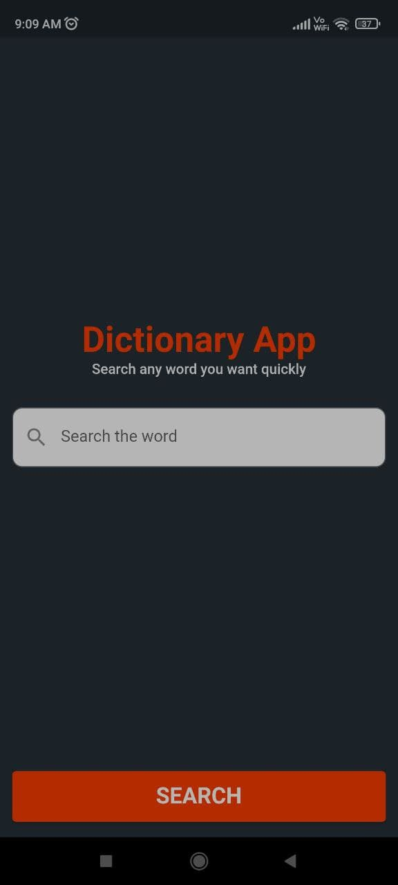
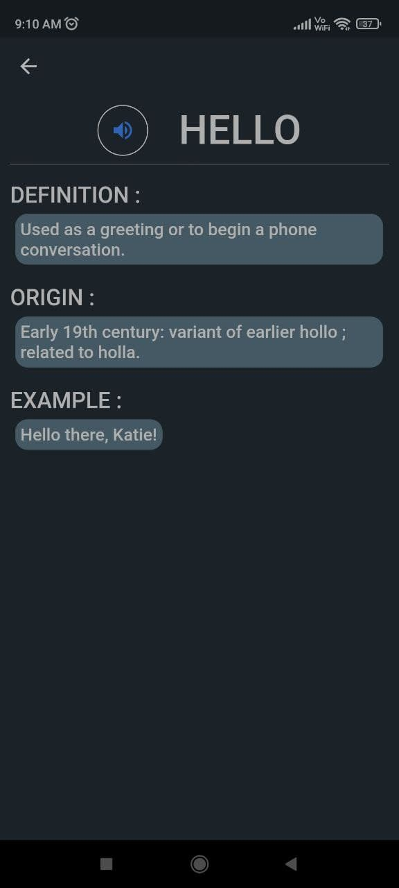
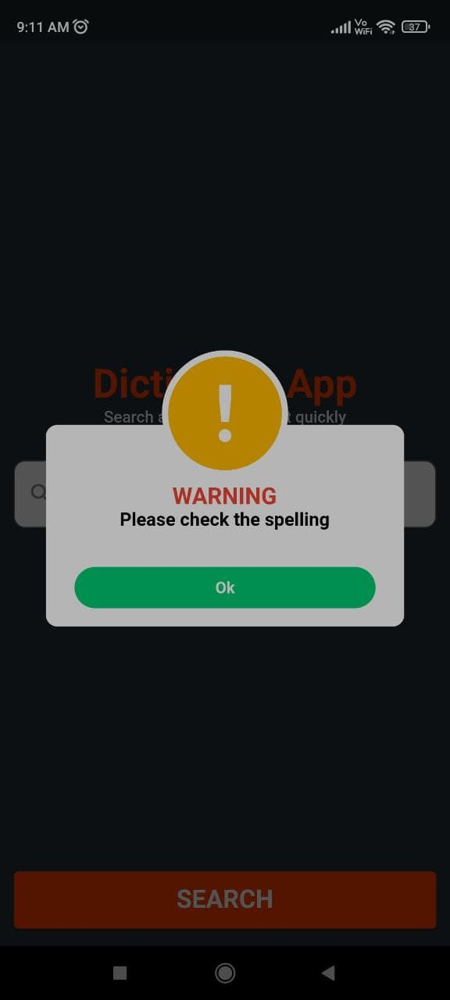

# Dictionary Flutter Application!

Dictionary Flutter Application is made with Flutter  which allows user to search words and fetch the meaning. Dictionary Flutter Application has E-Mail link authentication which allows unauthorized authentication. 

# Used API's

Dictionary Flutter Application use **Open Source API's** to meet the purpose of the app.

 - [Dictionary API](https://dictionaryapi.dev/)

# UI Design

